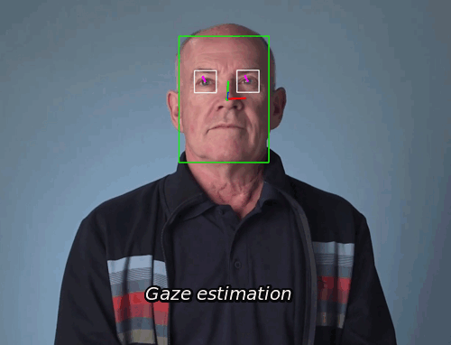
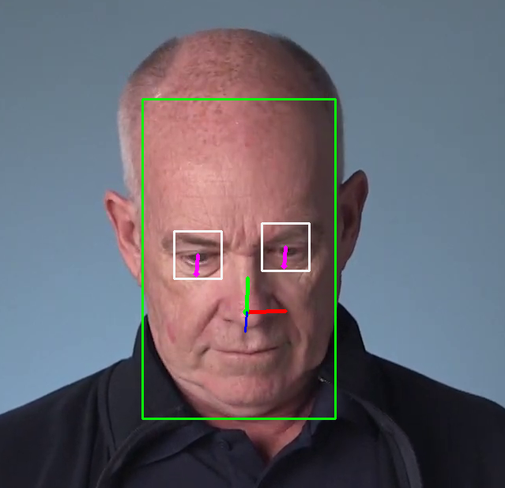
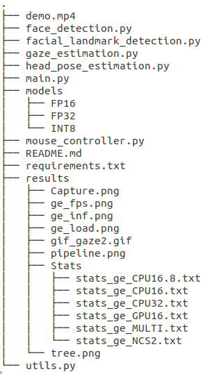
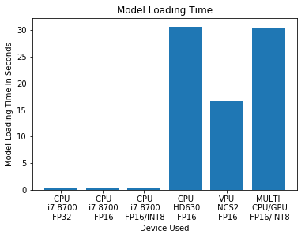
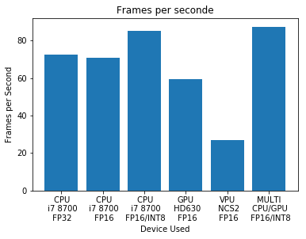

# Gaze Estimation

  
The gaze estimation model is used to estimate the gaze direction of the user's eyes. It can be used to control the computer mouse pointer.  
  
## Project Set Up and Installation

### Setup
The project need Intel's OpenVino ToolKit to be installed (version 2020.3 LTS).
Also required are the three pretrained models needed as an input pipeline for the gaze estimation model:
* Face detection model : face-detection-retail-0004
* Head pose estimation model : head-pose-estimation-adas-0001
* Face landmark detection model : landmarks-regression-retail-0009

And finally the gaze estimation model, itself:gaze-estimation-adas-0002

The "model downloader" could be used to download the models:
e.g. `python /opt/intel/openvino/deployment_tools/tools/model_downloader/downloader.py --name face-detection-retail-0004`

Put the models files in the "models" directory, grouped by precision subdirectory (FP32, FP16,...)

For all required dependency, see the requirements.txt file (created with `conda list --export`).

### The Pipeline

The different models are coordinated to manage the input video, extract the face (s), detect the landmark and estimate the pose for this detected face, and finally aggregate the detected eyes and head to make the gaze estimate. The pipeline is shown below:

## Demo

Open Invite Command and set the Environment Variables, if needed.
Change the directory to project directory and run main.py with the required arguments :

        `python3 main.py -mfd <path_to>/face-detection-retail-0004 \
        -mld <path_to>/landmarks-regression-retail-0009 \
        -mhp <path_to>/head-pose-estimation-adas-0001 \
        -mge <path_to>/gaze-estimation-adas-0002 \
        -i demo.mp4 -df fd hp ld ge -d CPU `

## Documentation

**Openvino documentation of the models:**
* [face-detection-retail-0004](https://docs.openvinotoolkit.org/latest/_models_intel_face_detection_retail_0004_description_face_detection_retail_0004.html)
* [landmarks-regression-retail-0009](https://docs.openvinotoolkit.org/latest/_models_intel_landmarks_regression_retail_0009_description_landmarks_regression_retail_0009.html)
* [head-pose-estimation-adas-0001](https://docs.openvinotoolkit.org/latest/_models_intel_head_pose_estimation_adas_0001_description_head_pose_estimation_adas_0001.html)
* [gaze-estimation-adas-0002](https://docs.openvinotoolkit.org/latest/_models_intel_gaze_estimation_adas_0002_description_gaze_estimation_adas_0002.html)

**Command line arguments:**

* **-mfd** : required, path to face detection model
* **-mld** : required, path to landmark detection model
* **-mhp** : required, path to head pose estimation model
* **-mge** : required, path to gaze estimation model
* **-i** : required, path to video file or CAM for camera
* **-d** : optional, device : CPU, GPU, FPGA, MYRIAD or MULTI (e.g. "MULTI:CPU(2),GPU(2)")
* **-l** : optional, path to CPU extension if needed
* **-df** : optional, draw flags, draw output of each selected model:
      * fd : Face detection -> green box
      * ld : Landmark detection -> white boxs(right and left eyes), green point for nose
      * hp : Head pose -> red, blue, green axis (origin: nose point)
      * ge : Gaze estimation -> magenta arrowLine

### Directory structure

The main.py file calls and executes each model of the pipeline (face_detection.py, ...).
The model directory contains a sub-directory for each model precision used (place the model files downloaded here).
The results directory groups together the statistical files produced during the benchmark and the graphics produced with.

## Benchmarks
The benchmark was made by running the model on an i7 8700 CPU with the integrated GPU HD630 and on an Neural Compute Stick (NCS2).The three model precisions were used when available: FP32, FP16 and INT8. The benchmarks includes: the loading time of the model, the image output per second and the total inference time of the model.

INT8 precision was only available for face detection and gaze estimation.
* **NCS2**: Neural Compute Stick 2 with FP16 precision.
* **MULTI**: Multiple device used: CPU and GPU ("MULTI:CPU(2),GPU(2)") with FP16 precision.

The benchmark was realized on the **demo.mp4** video.

## Results

The results show a valuable gain for inference in low precision, in terms of frames per second and total inference time. This gain is much greater for the INT8 precision. In addition, the losses in terms of precision are not significant.

It can be noted that if the results of the NCS2 device are lower than those of the other devices, they remain satisfactory.

In terms of load times, GPUs are worse than NCS2 and far beyond the CPU. Using multiple devices seems to add up the loading time of each device (this is more evident when you use NCS2 and GPU together).
It might be interesting to find a way to do a "parallel" loading.

Finally, we get the best result using several devices (using the two faster: GPU and CPU, with mixed precision of FP16 and INT8).

